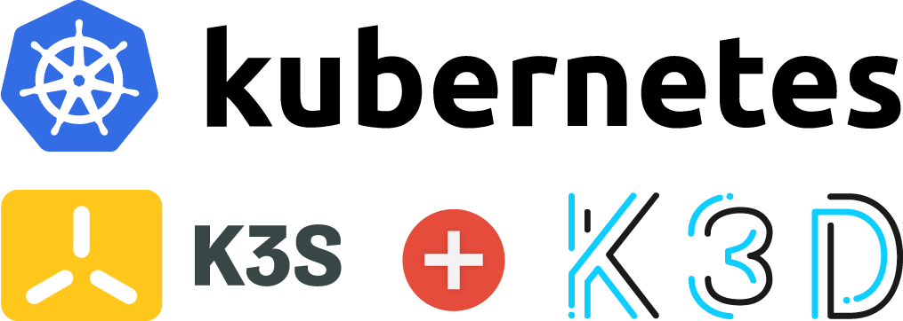

# Tutoriel Microservices avec Kubernetes - Les bases de K8s

L'objectif de cette série d'exercices est d'apprendre à démystifier Kubernetes (K8s) en s'intéressant aux concepts fondamentaux de cet orchestrateur. Nous commencerons par expliquer comment créer un cluster K8s sur son poste de développeur afin de pouvoir manipuler les concepts tels que les `Pods`, les `Deployments`, les `Services` et les `Volumes`. 

Ci-dessous sont détaillés les exercices de ce tutoriel :

* préparer son environnement d'orchestration K8s : différentes configurations sont détaillées (avec [K3d](https://k3d.io/) pour créer un cluster K8s avec [Docker](https://www.docker.com/ "Docker") ou avec [K3s](https://k3s.io/) pour créer un cluster K8s depuis des machines virtuelles) ;
* créer un premier `Pod` et manipuler son environnement d'orchestration K8s : créer et déployer une représentation logique de conteneurs en écrivant un fichier de configuration basé sur un objet `Pod` puis utiliser les outils **kubectl** et [K9s](https://k9scli.io/) ;
* créer et déployer une représentation logique de `Pods` : créer un `Deployment` et gérer la montée en charge des `Pods` (`ReplicaSets`) ;
* communiquer avec les Pods : créer et déployer des services de type `ClusterIP` et `NodePort` ;
* communiquer avec les Pods via des règles de routage : créer et déployer un objet de type `Ingress` ;
* conserver les données : créer des volumes et des volumes persistants (`PersistentVolume` et `PersistentVolumeClaim`). 

**Buts pédagogiques** : mettre en place un cluster K8s, créer un `Pod`, communiquer avec un `Pod`, partager des données entre des `Pods`, utiliser des outils d'administration (**kubectl** et [K9s](https://k9scli.io/)).

## Préparer son environnement de test : prérequis matériels et logiciels



Avant de démarrer cette série d'exercices, veuillez préparer votre poste de développeur en installant les outils suivants :

* Un PC ou un Mac avec au minimum 8 Go de mémoire et les options de virtualisation acives ;
* [Docker](https://www.docker.com/ "Docker") ;
* Editeur de texte : **vim**, **emacs** ou [VSCode](https://code.visualstudio.com/) ;
* [cURL](https://curl.haxx.se "cURL").

Récupérer le contenu de ce dépôt :

```
$ git clone https://github.com/mickaelbaron/microservices-kubernetes-gettingstarted-tutorial
```

Choisir votre environnement d'orchestration Kubernetes :

* [K3d (solution Docker in Docker)](./exercice0-k3d) : solution adaptée aux configurations matérielles légères (8 Go de mémoire)
* [K3s (solution à base de machines virtuelles)](./exercice0-k3s) : solution adaptée aux configurations matérielles plus robustes (16 Go de mémoire)

Seul un environnement est nécessaire pour réaliser les expérimentations de cette série d'exercices.

Ce tutoriel a été testé avec les systèmes suivants :

* macOS Big Sur
* Linux Ubuntu 20, Debian 11

> **Attention** si vous réalisez cette série d'exercices dans le cadre d'une formation avec plusieurs participants. Il est fortement recommandé d'utiliser un registre d'images [Docker](https://www.docker.com/ "Docker") privé pour éviter les [limites](https://www.docker.com/increase-rate-limits) imposer par l'utilisation de [Docker Hub](https://hub.docker.com/). En effet, chaque nœud de votre cluster K8s devra télécharger plusieurs images [Docker](https://www.docker.com/ "Docker") et la limite imposée par [Docker](https://www.docker.com/ "Docker") pour récupérer des images (100 en anonyme et 200 pour un compte gratuite toutes les six heures) peut être rapidement atteinte.

## Ressources

Retrouver les précédents tutoriels sur le sujet des conteneurs :

* [Tutoriel sur le développement de Microservices avec Docker et le langage Java](https://github.com/mickaelbaron/microservices-docker-java-tutorial)

Pour aller plus loin, vous pouvez consulter les ressources suivantes :

* [Support de cours sur une introduction aux architectures microservices](https://mickael-baron.fr/soa/introduction-microservices "Support de cours sur une introduction aux architectures microservices") ;
* [Support de cours sur les outils et bibliothèques pour la mise en œuvre d'architectures microservices](https://mickael-baron.fr/soa/microservices-mise-en-oeuvre "Support de cours sur les outils et bibliothèques pour la mise en œuvre d'architectures microservices") ;
* [Support de cours sur Kubernetes (K8s)](https://mickael-baron.fr/soa/microservices-k8s "Support de cours sur Kubernetes (K8s)").

## Remerciements

L'apprentissage de Kubernetes m'a pris un certain temps et j'ai pu compter sur de nombreuses ressources sur Internet. J'ai pu également compter sur de nombreuses personnes pour m'aiguiller à qui j'ai posé de nombreuses questions. Je voulais en profiter pour les remercier :

* Guilhem Lettron ([@guilhemlettron](https://twitter.com/guilhemlettron))
* Idriss Neumann ([@idriss_neumann](https://twitter.com/idriss_neumann))