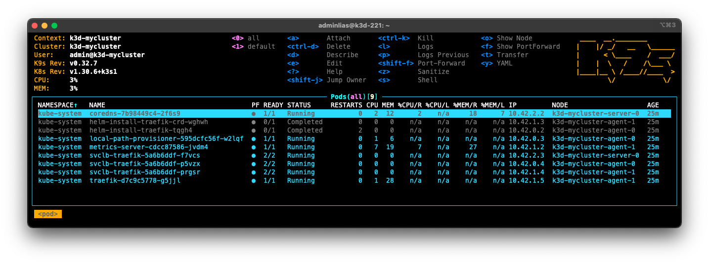

# Exercice 0 : préparer son environnement d'orchestration avec K3d

Cette préparation d'environnement cible la mise en place d'un cluster Kubernetes à partir de l'outil [K3d](https://k3d.io/) qui s'appuie sur la distribution légère [K3s](https://k3s.io/). [K3d](https://k3d.io/) sera utilisé comme solution _DinD_ => [Docker](https://www.docker.com/ "Docker") in [Docker](https://www.docker.com/ "Docker"). Cette approche _DinD_ permet de déployer un cluster Kubernetes multi-nœuds directement sur votre poste développeur. Tous les nœuds (maître et de travail) sont encapsulés dans un conteneur [Docker](https://www.docker.com/ "Docker"). L'avantage est de pouvoir profiter des performances des conteneurs (rapidité et occupation mémoire réduite) pour créer des nœuds.

Comme précisé en introduction, l'ensemble des expérimentations ont été testées depuis macOS et Linux. L'adaptation sous Windows n'est pas insurmontable, il faudra adapter certains scripts.

> **Il est important de signaler que cette préparation d'environnement ne peut être appliquée pour une mise en production. Elle est dédiée au poste du développeur qui souhaite s'assurer que les configurations fonctionnent correctement.**

## But

* Créer un cluster [K3d](https://k3d.io/)
* Installer les outils de gestion **kubectl** et [K9s](https://k9scli.io/)

## Étapes à suivre

[K3d](https://k3d.io/) sera donc utilisé pour créer notre cluster Kubernetes. Il s'agit d'un outil en ligne de commande qui encapsule la création des nœuds dans des conteneurs [Docker](https://www.docker.com/ "Docker").

Ci-dessous sont données les instructions d'installation de [K3d](https://k3d.io/) pour Linux et macOS.

---

**macOS** : pour installer [K3d](https://k3d.io/) via [Homebrew](https://brew.sh/) :

```
$ brew install k3d
```

**Linux** : pour installer [K3d](https://k3d.io/) :

```
$ wget -q -O - https://raw.githubusercontent.com/rancher/k3d/main/install.sh | bash
```

---

* Pour s'assurer que [K3d](https://k3d.io/) est correctement installé, exécuter les deux commandes suivantes :

```
$ k3d version
k3d version v5.4.7
k3s version v1.25.6-k3s1 (default)
```

Nous allons créer un cluster Kubernetes composé de trois nœuds dont un sera dédié au nœud maître et les deux autres seront dédiés aux nœuds de travail. Sous [K3d](https://k3d.io/), un nœud de travail est intitulé `agent` et un nœud maître est intitulé `server`.

* Créer un cluster Kubernetes via [K3d](https://k3d.io/) qui s'appelera `mycluster` :

```
$ k3d cluster create mycluster --agents 2 --servers 1
```

Cette commande crée un cluster Kubernetes appelé `mycluster`. Il contient deux nœuds de travail (`--agents 2`) et un (1) nœud maître (`--servers 1`). 

* Consulter les conteneurs [Docker](https://www.docker.com/ "Docker") qui ont été créés :

```
$ docker ps
CONTAINER ID   IMAGE                            COMMAND                  CREATED          STATUS          PORTS                             NAMES
9f2d698dbc2f   ghcr.io/k3d-io/k3d-tools:5.4.7   "/app/k3d-tools noop"    30 seconds ago   Up 28 seconds                                     k3d-mycluster-tools
f26ca44f1a13   ghcr.io/k3d-io/k3d-proxy:5.4.7   "/bin/sh -c nginx-pr…"   30 seconds ago   Up 18 seconds   80/tcp, 0.0.0.0:59937->6443/tcp   k3d-mycluster-serverlb
61f42423fc40   rancher/k3s:v1.25.6-k3s1         "/bin/k3d-entrypoint…"   35 seconds ago   Up 21 seconds                                     k3d-mycluster-agent-1
fc10281a3582   rancher/k3s:v1.25.6-k3s1         "/bin/k3d-entrypoint…"   35 seconds ago   Up 22 seconds                                     k3d-mycluster-agent-0
7e8c1dc93b0d   rancher/k3s:v1.25.6-k3s1         "/bin/k3d-entrypoint…"   35 seconds ago   Up 27 seconds                                     k3d-mycluster-server-0
```

Les deux nœuds de travail sont encapsulés par les deux conteneurs nommés `k3d-mycluster-agent-0` et `k3d-mycluster-agent-1`, le nœud maître est encapsulé par un (1) conteneur nommé `k3d-mycluster-server-0`, un conteneur `k3d-mycluster-serverlb` qui sert d'équilibreur de charge (_LoadBalancer_) pour le cluster K8s et finalement un conteneur `k3d-mycluster-tools` qui fournit des outils spécifiques comme par exemple l'importation d'images [Docker](https://www.docker.com/ "Docker") vers un cluster [K3s](https://k3s.io/).

Afin que nous puissions accéder au cluster Kubernetes, nous devons récupérer un fichier d'accès qui contiendra des informations comme les autorisations pour les outils clients. Ce fichier d'accès permet de communiquer avec le composant *API Server* d'un cluster.

* Se placer à la racine du dossier du dépôt de ce tutoriel et exécuter la ligne de commande suivante pour récupérer ce fichier d'accès :

```
$ k3d kubeconfig get mycluster > k3s.yaml
```

Nous avons désormais un cluster Kubernetes, mais nous ne disposns pas encore des outils pour interagir avec celui-ci. Nous détaillons ci-après comment installer les outils de gestion **kubectl** et [K9s](https://k9scli.io/) sur votre poste de développeur. Leurs utilisations seront détaillées dans l'exercice suivant.

**kubectl** et [K9s](https://k9scli.io/) sont des outils qui communiquent avec le composant *API Server* et nécessitent d'accéder au fichier *k3s.yaml* obtenu précédemment.

### Installation kubectl 

**kubectl** est un outil en ligne de commande (CLI) qui permet d'interagir avec un cluster Kubernetes via le composant **kube-apiserver**.

---

**macOS** : pour installer **kubectl** via [Homebrew](https://brew.sh/) :

```
$ brew install kubectl
```

**Linux** : pour installer **kubectl** sur n'importe quelle distribution Linux :

```
$ curl -LO https://storage.googleapis.com/kubernetes-release/release/$(curl -s https://storage.googleapis.com/kubernetes-release/release/stable.txt)/bin/linux/amd64/kubectl
$ chmod +x ./kubectl
$ sudo mv ./kubectl /usr/local/bin/kubectl
$ kubectl version --client
```

---

* Pour tester si **kubectl** est correctement installé :

```
$ export KUBECONFIG=$PWD/k3s.yaml
$ kubectl top nodes
NAME                     CPU(cores)   CPU%   MEMORY(bytes)   MEMORY%
k3d-mycluster-agent-0    26m          1%     102Mi           6%
k3d-mycluster-agent-1    36m          1%     176Mi           11%
k3d-mycluster-server-0   82m          4%     408Mi           27%
```

La première ligne de commande permet d'indiquer à **kubectl** où se trouve le fichier d'accès au cluster Kubernetes. Cette commande n'est à réaliser qu'une seule fois à l'ouvertue de votre terminal. Le seconde ligne de commande permet d'obtenir des informations sur les ressources utilisées par des objets gérés par Kubernetes (ici l'objet est un nœud).

### Installation K9s

[K9s](https://k9scli.io/) est un gestionnaire de cluster Kubernetes qui a la particularité de fonctionner dans la console. L'interface utilisateur est très simpliste, mais permet de retourner en continu l'état du cluster.

---

**macOS** : pour installer **K9s** via [Homebrew](https://brew.sh/) :

```
$ brew install k9s
```

**Linux** : pour installer **K9s** :

```
$ wget https://github.com/derailed/k9s/releases/download/v0.25.15/k9s_Linux_x86_64.tar.gz
$ tar xzf k9s_Linux_x86_64.tar.gz
```

---

* Pour tester si **K9s** est correctement installé, depuis un autre terminal :

```
$ export KUBECONFIG=./k3s.yaml
$ k9s
```

Vous devriez obtenir le même résultat que sur la figure ci-dessous.



## Configurer un registre d'images Docker miroir

L'utilisation de Kubernetes amène à télécharger de nombreuses images [Docker](https://www.docker.com/ "Docker") depuis le dépôt [Docker HUB](https://hub.docker.com/ "Docker HUB"). Le problème est que ce dernier impose une limite à 100 téléchargements d'image [Docker](https://www.docker.com/ "Docker") chaque 6 heures par adresse IP (ou 200 téléchargements pour les utilisateurs authentifiés). Des informations supplémentaires sont disponibles ici : https://docs.docker.com/docker-hub/download-rate-limit/.

Si vous souhaitez connaître l'état de votre consommation, veuillez procéder aux manipulations suivantes.

* Pour obtenir un _token_, en anonyme.

```console
$ TOKEN=$(curl "https://auth.docker.io/token?service=registry.docker.io&scope=repository:ratelimitpreview/test:pull" | jq -r .token)
```

* Ou pour obtenir un _token_ en mode authentifié.

```console
$ TOKEN=$(curl --user 'username:password' "https://auth.docker.io/token?service=registry.docker.io&scope=repository:ratelimitpreview/test:pull" | jq -r .token)
```

* Enfin, pour obtenir les informations liées au quota de [Docker HUB](https://hub.docker.com/ "Docker HUB").

```console
$ curl --head -H "Authorization: Bearer $TOKEN" https://registry-1.docker.io/v2/ratelimitpreview/test/manifests/latest
HTTP/1.1 200 OK
content-length: 2782
content-type: application/vnd.docker.distribution.manifest.v1+prettyjws
docker-content-digest: sha256:767a3815c34823b355bed31760d5fa3daca0aec2ce15b217c9cd83229e0e2020
docker-distribution-api-version: registry/2.0
etag: "sha256:767a3815c34823b355bed31760d5fa3daca0aec2ce15b217c9cd83229e0e2020"
date: Tue, 07 Feb 2023 11:33:38 GMT
strict-transport-security: max-age=31536000
ratelimit-limit: 100;w=21600
ratelimit-remaining: 100;w=21600
docker-ratelimit-source: X.Y.Z.W
```

La limite est fixée par `ratelimit-limit: 100;w=21600` et la consommation par `ratelimit-remaining: 100;w=21600`. 

Pour résoudre le problème de quota au niveau de [Docker HUB](https://hub.docker.com/ "Docker HUB"), vous pouvez soit passer par un abonnement payant soit passer par un miroir d'images [Docker](https://www.docker.com/ "Docker") privé. C'est cette seconde solution que nous allons expliquer dans la suite. Bien entendu il vous conviendra de fournir un miroir d'images [Docker](https://www.docker.com/ "Docker") privé, nous montrerons simplement comment configurer un cluster [K3d](https://k3d.io/) avec un miroir d'images [Docker](https://www.docker.com/ "Docker") privé.

* Créer un fichier de configuration appelé _registries.yaml_ avec le contenu suivant.

```yaml
mirrors:
  "docker.io":
    endpoint:
      - https://URL_YOUR_REGISTRY
```

* La configuration du miroir d'images [Docker](https://www.docker.com/ "Docker") privé se fait lors de la création du cluster [K3d](https://k3d.io/).

```
$ k3d cluster create mycluster --agents 2 --servers 1 --registry-config "$(pwd)/my-registries.yaml"
```

## Bilan de l'exercice

À cette étape, vous disposez :

* d'un cluster Kubernetes avec trois nœuds dont un pour le maître et deux autres pour les nœuds de travail ;
* de deux outils de contrôle pour notre cluster Kubernetes.

## Ressources

* https://betterprogramming.pub/local-k3s-cluster-made-easy-with-multipass-108bf6ce577c
* https://k33g.gitlab.io/articles/2020-02-21-K3S-01-CLUSTER.html