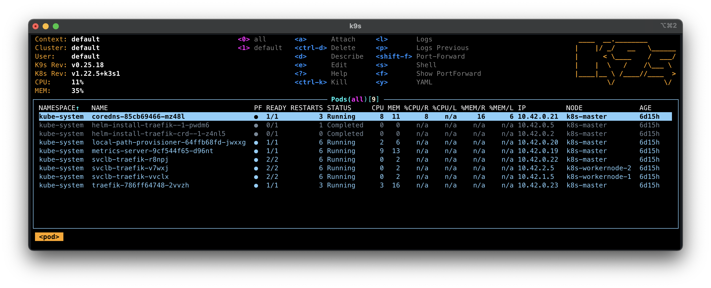

# Exercice 0 : préparer son environnement d'orchestration avec K3s

Cette préparation d'environnement cible la mise en place d'un cluster Kubernetes à partir de la distribution légère [K3s](https://k3s.io/). Nous nous appuierons sur [MultiPass](https://multipass.run/) pour créer trois machines virtuelles sur votre poste développeur qui serviront à héberger notre cluster Kubernetes. Comme nous ne déploierons pas de grosses applications sur notre cluster, les ressources allouées aux machines virtuelles seront réduites (1 coeur et 1 Go de mémoire).

Comme précisé en introduction, l'ensemble des expérimentations ont été testées depuis macOS et Linux. L'adaptation sous Windows n'est pas insurmontable, il faudra adapter certains scripts.

## But

* Créer des machines virtuelles avec [MultiPass](https://multipass.run/)
* Créer un cluster Kubernetes avec la distribution [K3s](https://k3s.io/)
* Installer les outils de gestion **kubectl** et [K9s](https://k9scli.io/)

## Étapes à suivre

> La procédure d'installation de [K3s](https://k3s.io/) est basée sur l'article de Philippe Charrière que vous pouvez retrouver ici : https://k33g.gitlab.io/articles/2020-02-21-K3S-01-CLUSTER.html

Nous utiliserons [MultiPass](https://multipass.run/) pour créer des machines virtuelles. Il s'agit d'un gestionnaire de machines virtuelles créé par [Canonical](https://canonical.com/) l'entreprise qui est derrière la distribution Linux [Ubuntu](https://ubuntu.com). [MultiPass](https://multipass.run/) s'appuie sur les hyperviseurs KVM pour Linux, Hyper-V pour Windows et HyperKit sur macOS pour exécuter une machine virtuelle. 

Nous donnons ci-dessous les instructions d'installation pour Linux et macOS.

---

**macOS** : pour installer [MultiPass](https://multipass.run/) via [Homebrew](https://brew.sh/) :

```
$ brew install --cask multipass
```

**Linux** : pour installer [MultiPass](https://multipass.run/) via [snap](https://snapcraft.io/) :

```
$ sudo snap install multipass
```

---

* Pour s'assurer que [MultiPass](https://multipass.run/) est correctement installé, exécuter les deux commandes suivantes :

```
$ multipass
Usage: multipass [options] <command>
Create, control and connect to Ubuntu instances.

This is a command line utility for multipass, a
service that manages Ubuntu instances.

Options:
  -h, --help     Displays help on commandline options.
  --help-all     Displays help including Qt specific options.
  -v, --verbose  Increase logging verbosity. Repeat the 'v' in the short option
                 for more detail. Maximum verbosity is obtained with 4 (or more)
                 v's, i.e. -vvvv.

Available commands:
  alias     Create an alias
  aliases   List available aliases
  delete    Delete instances
  exec      Run a command on an instance
  find      Display available images to create instances from
  get       Get a configuration setting
  help      Display help about a command
  info      Display information about instances
  launch    Create and start an Ubuntu instance
  list      List all available instances
  mount     Mount a local directory in the instance
  networks  List available network interfaces
  purge     Purge all deleted instances permanently
  recover   Recover deleted instances
  restart   Restart instances
  set       Set a configuration setting
  shell     Open a shell on a running instance
  start     Start instances
  stop      Stop running instances
  suspend   Suspend running instances
  transfer  Transfer files between the host and instances
  umount    Unmount a directory from an instance
  unalias   Remove an alias
  version   Show version details

$ multipass version
multipass   1.8.1+mac
multipassd  1.8.1+mac
```

* Nous créons maintenant trois machines virtuelles dont une sera dédiée au nœud maître (`k8s-master`) et les deux autres seront dédiées aux nœuds de travail (`k8s-workernode-1` et `k8s-workernode-2`) :

```
$ multipass launch -n k8s-master --cpus 1 --mem 2G
$ multipass launch -n k8s-workernode-1 --cpus 1 --mem 1G
$ multipass launch -n k8s-workernode-2 --cpus 1 --mem 1G
```

Le temps de création peut-être un peu long puisque [MultiPass](https://multipass.run/) va commencer par télécharger l'image [Ubuntu](https://ubuntu.com) et réaliser les installations.

* Assurons-nous que les trois machines virtuelles ont été créées et qu'elles sont démarrées :

```
$ multipass list
Name                    State             IPv4             Image
k8s-master              Running           192.168.64.9     Ubuntu 20.04 LTS
k8s-workernode-1        Running           192.168.64.10    Ubuntu 20.04 LTS
k8s-workernode-2        Running           192.168.64.11    Ubuntu 20.04 LTS
```

* Vérifions également que l'accès au réseau fonctionne (DNS) :

```
$ multipass exec k8s-master -- ping www.google.fr
PING www.google.fr (142.251.37.35) 56(84) bytes of data.
64 bytes from XYZ (142.251.37.35): icmp_seq=1 ttl=115 time=16.6 ms
64 bytes from XYZ (142.251.37.35): icmp_seq=1 ttl=115 time=16.7 ms
...
```

> Dans le cas où la résolution de noms pose problème, vous pouvez modifier l'adresse IP du serveur DNS depuis le fichier _/etc/resolv.conf_. Les lignes de commande ci-dessous permettent de changer directement l'IP du DNS de chaque machine virtuelle.

```
$ multipass exec k8s-master -- sudo sed -ri 's/nameserver.*/nameserver 8.8.8.8/g' /etc/resolv.conf
$ multipass exec k8s-workernode-1 -- sudo sed -ri 's/nameserver.*/nameserver 8.8.8.8/g' /etc/resolv.conf
$ multipass exec k8s-workernode-2 -- sudo sed -ri 's/nameserver.*/nameserver 8.8.8.8/g' /etc/resolv.conf
```

L'accès aux machines virtuelles se fait directement depuis l'outil **multipass**. Si vous souhaitez passer par un accès via SSH, vous devrez configurer chaque machine virtuelle en ajoutant votre clé SSH publique.

* Pour installer [K3s](https://k3s.io/) sur le nœud maître :

```
$ multipass --verbose exec k8s-master -- sh -c "
  curl -sfL https://get.k3s.io | sh -
"
```

Le nœud maître étant installé, nous allons pouvoir récupérer un jeton (`TOKEN`) d'identification et l'adresse IP du cluster Kubernetes. Ces informations nous serviront pour ajouter des nœuds de travail au cluster (actuellement composé d'un seul nœud).

* Pour obtenir le `TOKEN` d'identification du cluster et son adresse IP :

```
$ TOKEN=$(multipass exec k8s-master sudo cat /var/lib/rancher/k3s/server/node-token)
$ IP=$(multipass info k8s-master | grep IPv4 | awk '{print $2}')
```

* Pour ajouter au cluster le premier nœud de travail :

```
$ multipass --verbose exec k8s-workernode-1 -- sh -c "
  curl -sfL https://get.k3s.io | K3S_URL='https://$IP:6443' K3S_TOKEN='$TOKEN' sh -
"
```

* De même pour ajouter le second nœud de travail :

```
$ multipass --verbose exec k8s-workernode-2 -- sh -c "
    curl -sfL https://get.k3s.io | K3S_URL='https://$IP:6443' K3S_TOKEN='$TOKEN' sh -
  "
```

Vous remarquerez que l'ajout d'un nouveau nœud de travail se fait assez facilement.

* Pour afficher l'état des machines virtuelles : 

```
$ multipass list
Name                    State             IPv4             Image
k8s-master              Running           192.168.64.9     Ubuntu 20.04 LTS
                                          10.42.0.0
                                          10.42.0.1
k8s-workernode-1        Running           192.168.64.10    Ubuntu 20.04 LTS
                                          10.42.1.0
                                          10.42.1.1
k8s-workernode-2        Running           192.168.64.11    Ubuntu 20.04 LTS
                                          10.42.2.0
                                          10.42.2.1
```

Afin que nous puissions accéder au Cluster, nous devons récupérer un fichier d'accès qui contiendra des informations comme les autorisations pour les outils clients. Ce fichier d'accès permet de communiquer avec le composant *API Server* d'un cluster.

* Se placer à la racine du dossier du dépôt de ce tutoriel et exécuter les deux lignes de commande suivantes pour récupérer ce fichier d'accès :

```
$ multipass exec k8s-master -- sudo cat /etc/rancher/k3s/k3s.yaml > k3s.yaml
$ sed -i '' "s/127.0.0.1/$IP/" k3s.yaml
```

Le script _exercice0-k3s/exportvmip.sh_ sert à initialiser trois variables d'environnement (`k8s_master_ip`, `k8s_workernode1_ip` et `k8s_workernode2_ip`) qui contiendront les adresses IP de tous les nœuds. Ce script nous sera utile quand nous devrons effectuer des requêtes à partir des nœuds du cluster.

* Pour exécuter le script _exercice0-k3s/exportvmip.sh_ :

```
$ source exercice0-k3s/exportvmip.sh
k8s-master 🧑: k8s_master_ip=192.168.64.9
k8s-workernode1-ip 👷: k8s_workernode1_ip=192.168.64.10
k8s-workernode2-ip 👷: k8s_workernode2_ip=192.168.64.11

$ echo $k8s_master_ip
192.168.64.9
$ echo $k8s_workernode1_ip
192.168.64.10
$ echo $k8s_workernode2_ip
192.168.64.11
```

Il est important d'utiliser la commande `$ source exercice0-k3s/extractnodeip.sh` car contrairement à `$ ./exercice0-k3s/extractnodeip.sh` l'exécution du script _extractnodeip.sh_ se fera dans la session shell courante et nous pourrons réutiliser les trois variables d'environnement.

Toutes les instructions précédentes ont été regroupées dans un fichier script _exercice0-k3s/createk3scluster.sh_. Il permet de paramétrer le nombre de nœuds de travail, la seule limite étant les ressources de votre ordinateur.

* Pour exécuter le script _exercice0-k3s/createk3scluster.sh_ :

```bash
./createk3scluster.sh 3
Launched: k8s-master
[INFO]  Finding release for channel stable
[INFO]  Using v1.22.5+k3s1 as release
[INFO]  Downloading hash https://github.com/k3s-io/k3s/releases/download/v1.22.5+k3s1/sha256sum-amd64.txt
[INFO]  Downloading binary https://github.com/k3s-io/k3s/releases/download/v1.22.5+k3s1/k3s
[INFO]  Verifying binary download
[INFO]  Installing k3s to /usr/local/bin/k3s
[INFO]  Skipping installation of SELinux RPM
[INFO]  Creating /usr/local/bin/kubectl symlink to k3s
[INFO]  Creating /usr/local/bin/crictl symlink to k3s
[INFO]  Creating /usr/local/bin/ctr symlink to k3s
[INFO]  Creating killall script /usr/local/bin/k3s-killall.sh
[INFO]  Creating uninstall script /usr/local/bin/k3s-uninstall.sh
[INFO]  env: Creating environment file /etc/systemd/system/k3s.service.env
[INFO]  systemd: Creating service file /etc/systemd/system/k3s.service
[INFO]  systemd: Enabling k3s unit
Created symlink /etc/systemd/system/multi-user.target.wants/k3s.service → /etc/systemd/system/k3s.service.
[INFO]  systemd: Starting k3s
✅ K3s initialized on k8s-master
Token: K109373e4f1d0eb9ba0979d7e64b902652d488be8441ed19d7b1fc1a71bdfa58502::server:8e0b8fdd7c2631f93c9b51a27f587b81
IP: 192.168.64.9
Launched: k8s-workernode-1
[INFO]  Finding release for channel stable
...
[INFO]  systemd: Starting k3s-agent
✅ k8s-workernode-1 has joined the Cluster
Launched: k8s-workernode-2
[INFO]  Finding release for channel stable
...
[INFO]  systemd: Starting k3s-agent
✅ k8s-workernode-2 has joined the Cluster
```

Nous avons désormais un cluster Kubernetes, mais nous ne disposns pas encore des outils pour interagir avec celui-ci. Nous détaillons ci-après comment installer les outils de gestion **kubectl** et [K9s](https://k9scli.io/) sur votre poste de développeur. Leurs utilisations seront détaillées dans l'exercice suivant.

**kubectl** et [K9s](https://k9scli.io/) sont des outils qui communiquent avec le composant *API Server* et nécessitent d'accéder au fichier *k3s.yaml* obtenu précédemment.

### Installation kubectl 

**kubectl** est un outil en ligne de commande (CLI) qui permet d'interagir avec un cluster Kubernetes via le composant **kube-apiserver**.

---

**macOS** : pour installer **kubectl** via [Homebrew](https://brew.sh/) :

```
$ brew install kubectl
```

**Linux** : pour installer **kubectl** sur n'importe quelle distribution Linux :

```
$ curl -LO https://storage.googleapis.com/kubernetes-release/release/$(curl -s https://storage.googleapis.com/kubernetes-release/release/stable.txt)/bin/linux/amd64/kubectl
$ chmod +x ./kubectl
$ sudo mv ./kubectl /usr/local/bin/kubectl
$ kubectl version --client
```

---

* Pour tester si **kubectl** est correctement installé :

```
$ export KUBECONFIG=$PWD/k3s.yaml
$ kubectl top nodes
NAME               CPU(cores)   CPU%   MEMORY(bytes)   MEMORY%
k8s-master         77m          7%     927Mi           46%
k8s-workernode-1   20m          2%     469Mi           47%
k8s-workernode-2   20m          2%     472Mi           48%
```

La première ligne de commande permet d'indiquer à **kubectl** où se trouve le fichier d'accès au cluster Kubernetes. Cette commande n'est à réaliser qu'une seule fois à l'ouvertue de votre terminal. Le seconde ligne de commande permet d'obtenir des informations sur les ressources utilisées par des objets gérés par Kubernetes (ici l'objet est un nœud).

### Installation K9s

[K9s](https://k9scli.io/) est un gestionnaire de cluster Kubernetes qui a la particularité de fonctionner dans la console. L'interface utilisateur est très simpliste, mais permet de retourner en continu l'état du cluster.

---

**macOS** : pour installer **K9s** via [Homebrew](https://brew.sh/) :

```
$ brew install k9s
```

**Linux** : pour installer **K9s** :

```
$ wget https://github.com/derailed/k9s/releases/download/v0.25.15/k9s_Linux_x86_64.tar.gz
$ tar xzf k9s_Linux_x86_64.tar.gz
```

---

* Pour tester si **K9s** est correctement installé, depuis un autre terminal :

```
$ export KUBECONFIG=./k3s.yaml
$ k9s
```

Vous devriez obtenir le même résultat que sur la figure ci-dessous.



## Bilan de l'exercice

À cette étape, vous disposez :

* d'un cluster Kubernetes avec trois nœuds dont un pour le maître et deux autres pour les nœuds de travail ;
* de deux outils de contrôle pour notre cluster Kubernetes.

## Ressources

* https://betterprogramming.pub/local-k3s-cluster-made-easy-with-multipass-108bf6ce577c
* https://k33g.gitlab.io/articles/2020-02-21-K3S-01-CLUSTER.html