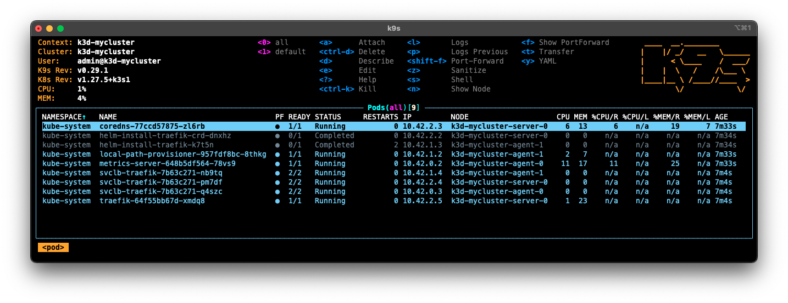
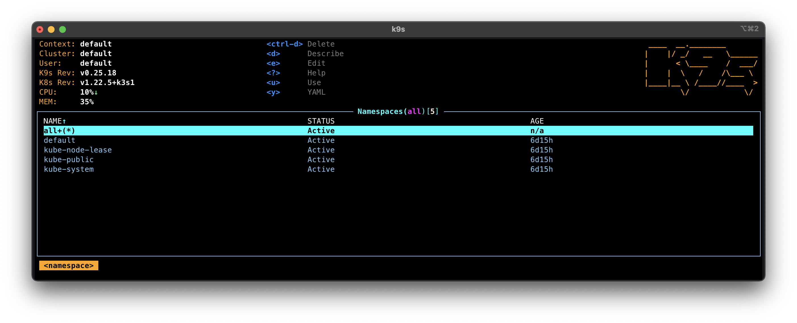
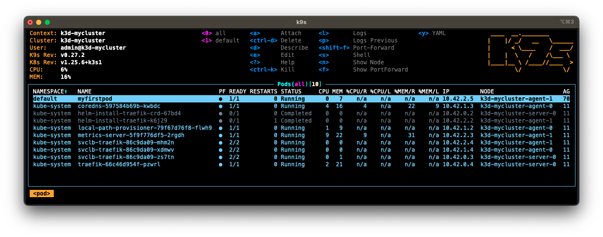
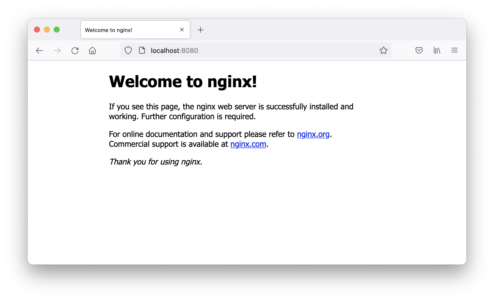

# Exercice 1 : créer un premier POD et manipuler son environnement d'orchestration K8s

Ce premier exercice s'intéresse à la création de l'entité de référence dans un cluster Kubernetes à savoir un `Pod` qui est une représentation logique de un ou plusieurs conteneurs. Nous allons donc voir comment manipuler un `Pod` pour le créer, s'y connecter via son conteneur associé et pour le supprimer. Nous étudierons également comment écrire un fichier de configuration utilisé pour faciliter l'exportation des paramètres d'un `Pod`. Nous verrons également l'intérêt d'utiliser un `Namespace` pour isoler les différents objets créés dans un cluster Kubernetes. Enfin, nous montrerons via une première solution comment accéder à un `Pod` par le réseau.

Ce premier exercice sera aussi l'occasion de manipuler les outils **kubectl** et [K9s](https://k9scli.io/) que nous avons installés lors de la mise en place de notre cluster Kubernetes.

> Quelque soit le type d'installation choisi pour la mise en place de votre cluster Kubernetes, toutes les commandes ci-dessous devraient normalement fonctionner. Nous considérons qu'il existe un fichier `k3s.yaml` à la racine du dossier `microservices-kubernetes-gettingstarted-tutorial/`, si ce n'est pas le cas, merci de reprendre la mise en place d'un cluster Kubernetes. Il est important ensuite de s'assurer que la variable `KUBECONFIG` soit initialisée avec le chemin du fichier d'accès au cluster Kubernetes (`export KUBECONFIG=$PWD/k3s.yaml`).

## But

* Manipuler un `Pod` (créer, se connecter via son conteneur associé, supprimer)
* Écrire un fichier de configuration pour décrire un objet `Pod`
* Accéder à un `Pod` via le réseau
* Organiser les `Pods` via les `Namespaces`

## Étapes à suivre

* Créer deux invites de commande, l'une pour l'exécution de [K9s](https://k9scli.io/) et la seconde pour la saisie des commandes avec l'outil **kubectl**, puis se placer pour chaque invite de commande à la racine du dossier `microservices-kubernetes-gettingstarted-tutorial/`. Pour faciliter l'identification des invites de commande, nous les appellerons respectivement *k9s* et *kubectl*.

* Depuis l'invite de commande *k9s* : 

```bash
k9s
```



L'outil [K9s](https://k9scli.io/) affiche tous les objets créés au sein du cluster. L'affichage au démarrage donne l'ensemble des objets de type `Pod`. Les `Pods` déjà présents concernent le fonctionnement interne de Kubernetes. Ces `Pods` sont identifiables par le `Namespace` appelé `kube-system` (colonne `NAMESPACE`).

L'utilisation [K9s](https://k9scli.io/) est très proche de l'éditeur de texte **Vim**. Deux modes sont disponibles : *commande* et *recherche*. Pour saisir une commande, la touche `:` doit être utilisée. Ce mode est identifiable par la forme du prompt `🐶>` qui représente un chien de race Bigle (enfin je crois). L'ensemble des commandes est disponible via le raccourci `CTRL + a` ou via la commande `:aliases`. Pour effectuer une recherche, la touche `/` doit être utilisée. Ce mode est identifiable par la forme du prompt `🐩>` qui est un chien de race Caniche (il n'y a pas à se tromper là).

* Depuis l'outil [K9s](https://k9scli.io/), afficher la liste des `Namespaces` via la commande `:namespaces`.



> Le résultat est identique selon que vous utilisez le singulier ou le pluriel. `:namespaces` donne le même résultat que `:namespace`.

Un ensemble de `Namespace` est donné par l'outil [K9s](https://k9scli.io/). Ces `Namespaces` existent déjà car ils sont utilisés pour le fonctionnement interne de Kubernetes.

* Depuis l'outil [K9s](https://k9scli.io/), retourner à l'affichage de la liste des `Pods` via la commande `:pods`.

Nous allons obtenir les mêmes informations depuis l'outil **kubectl**. Cependant, contrairement à l'outil [K9s](https://k9scli.io/), elles ne pourront être mises à jour qu'en exécutant plusieurs fois la même ligne de commande. En effet, [K9s](https://k9scli.io/) est réactif et tout changement sur le cluster Kubernetes est automatiquement affiché à l'utilisateur (sous condition qu'il se trouve dans la bonne commande).

* Depuis l'invite de commande *kubectl* :

```bash
kubectl get pods --all-namespaces
```

La sortie console attendue :

```bash
NAMESPACE     NAME                                      READY   STATUS      RESTARTS   AGE
kube-system   coredns-7b98449c4-ks2sf                   1/1     Running     0          2m11s
kube-system   helm-install-traefik-crd-l98k2            0/1     Completed   0          2m11s
kube-system   helm-install-traefik-rszld                0/1     Completed   1          2m11s
kube-system   local-path-provisioner-595dcfc56f-zc5vw   1/1     Running     0          2m11s
kube-system   metrics-server-cdcc87586-z55gf            1/1     Running     0          2m11s
kube-system   svclb-traefik-a8a5499c-5b4t6              2/2     Running     0          113s
kube-system   svclb-traefik-a8a5499c-8d92f              2/2     Running     0          113s
kube-system   svclb-traefik-a8a5499c-mn5dd              2/2     Running     0          113s
kube-system   traefik-d7c9c5778-2nqnm                   1/1     Running     0          113s
```

L'option `get` permet de récupérer les informations de l'objet passé en paramètre `pods`. Le paramètre `--all-namespaces` indique que tous les `Namespaces` sont considérés.

* Affichons maintenant la liste des `Namespaces` de notre cluster Kubernetes, depuis l'invite de commande *kubectl* :

```bash
kubectl get namespace
```

La sortie console attendue :

```bash
NAME              STATUS   AGE
default           Active   2m57s
kube-node-lease   Active   2m57s
kube-public       Active   2m57s
kube-system       Active   2m57s
```

Il est maintenant temps de créer notre premier `Pod` qui, pour rappel, est une représentation logique de un ou plusieurs conteneurs. 

* Dans l'exemple qui va suivre, nous allons créer un `Pod` avec un conteneur basé sur l'image du serveur web [Nginx](https://www.nginx.com/). Depuis l'invite de commande *kubectl* :

```bash
kubectl run myfirstpod --image=nginx:latest
```

La sortie console attendue :

```bash
pod/myfirstpod created
```

* Pour s'assurer que le `Pod` a été créé :

```bash
kubectl get pods
```

La sortie console attendue :

```bash
NAME         READY   STATUS    RESTARTS   AGE
myfirstpod   1/1     Running   0          34s
```

Depuis l'outil [K9s](https://k9scli.io/), vous devriez obtenir le résultat suivant (commande `:pods` si vous n'affichez pas la liste des `Pods`).



Puisque notre premier `Pod` a été créé et déployé sans problème, nous allons vérifier si la page web par défaut de [Nginx](https://www.nginx.com/) est retournée après une requête HTTP. L'accès depuis l'extérieur d'un cluster K8s à un `Pod` se fait généralement par les services. Toutefois, nous découvrirons les services plus tard dans les prochains exercices. En attendant, nous allons utiliser une technique d'exposition des `Pods` via une redirection des ports. Cette technique ne peut être mise en place que par l'intermédiaire des outils **kubectl** et [K9s](https://k9scli.io/). Cette redirection des ports n'est à utiliser que pour les phases de test, **ne jamais utiliser cette technique pour la mise en production de vos microservices**.

* Depuis l'invite de commande *kubectl* :

```bash
kubectl port-forward myfirstpod 8080:80
```

La sortie console attendue :

```bash
Forwarding from 127.0.0.1:8080 -> 80
Forwarding from [::1]:8080 -> 80
Handling connection for 8080
```

L'option `port-forward` permet de créer un pont entre la machine locale (depuis le port 8080) et notre `Pod` (vers le port 80). À l'éxécution de cette commande, le processus **kubectl** devient bloquant.

> Vous pouvez également utiliser l'option `--address 0.0.0.0` pour exposer à toutes les adresses IP de la machine.

* Ouvrir la page par défaut de [Nginx](https://www.nginx.com/) depuis un navigateur : http://localhost:8080.



* Arrêter le processus bloquant **kubectl** depuis l'invite de commande *kubectl* via `CTRL+C`.

Puisqu'un `Pod` est une représentation logique de un ou plusieurs conteneurs, nous pouvons exécuter une commande directement sur les conteneurs d'un `Pod`. 

* Depuis l'invite de commande *kubectl* :

```bash
kubectl exec -it myfirstpod -- /bin/bash
ls # Depuis root@myfirstpod:/#
```

La sortie console attendue :

```bash
bin  boot  dev	docker-entrypoint.d  docker-entrypoint.sh  etc	home  lib  lib64  media  mnt  opt  proc  root  run  sbin  srv  sys  tmp  usr  var
```

L'option `exec` permet d'exécuter une commande sur un conteneur d'un `Pod`. Comme un `Pod` peut représenter plusieurs conteneurs, il est possible d'indiquer le conteneur sur lequel la commande doit être exécutée. S'il n'y a pas de conteneur d'indiquer en paramètre, le conteneur par défaut choisi sera le premier. Dans notre cas, comme il n'y a qu'un conteneur dans notre `Pod`, c'est le conteneur associé à l'image [Nginx](https://www.nginx.com/) qui sera utilisé. Les options `i` et `t` indiquent que la commande à exécuter sera interactive et le résultat sera affiché sur le teminal courant. Ces options sont identiques à [Docker](https://www.docker.com/ "Docker"). L'option `--` précise que les paramètres qui suivront concerneront la commande à exécuter par le conteneur. Dans cet exemple, nous ouvrons un prompt depuis le conteneur. 

Nous allons changer la page HTML par défaut, en modifiant le contenu du fichier */usr/share/nginx/html/index.html*.

* Toujours depuis l'invite de commande *kubectl*, vous devriez toujours être dans le prompt du conteneur [Nginx](https://www.nginx.com/) :

```bash
echo "Modification de la page web par defaut" > /usr/share/nginx/html/index.html # Depuis root@myfirstpod:/# 
exit # Depuis root@myfirstpod:/#
kubectl port-forward myfirstpod 8080:80
```

* Depuis une nouvelle invite de commande, nous allons récupérer le contenu de la page web via l'outil [cURL](https://curl.haxx.se "cURL") :

```bash
curl http://localhost:8080
```

La sortie console attendue :

```bash
Modification de la page web par defaut
```

* Arrêter le pont réseau entre la machine locale et le `Pod` via `CTRL+C` puis supprimer le `Pod` depuis l'invite de commande *kubectl* :

```bash
kubectl delete pods myfirstpod
```

La sortie console attendue :

```
pod "myfirstpod" deleted
```

Pour l'instant, nous avons créé un `Pod` via l'option `run` de l'outil **kubectl**. Nous allons utiliser un fichier de configuration basée sur une syntaxte YAML. 

* Créer dans le répertoire _exercice1-pod-tools/_ un fichier appelé `mypod.yaml` en ajoutant le contenu suivant :

```yaml
apiVersion: v1
kind: Pod
metadata:
  name: mypod
spec:
  containers:
  - name: mycontainer-1
    image: nginx:latest
    ports:
    - containerPort: 80
  - name: mycontainer-2
    image: alpine:latest
    command: ["watch", "wget", "-qO-", "localhost"]
```

Ce fichier de configuration décrit un objet de type `Pod`. Deux conteneurs sont déclarés. Le premier est un conteneur basé sur l'image du serveur web [Nginx](https://www.nginx.com/) (identique aux instructions précédentes) et le second est un conteneur basé sur l'image d'une distribution minimaliste Linux [Alpine](https://www.alpinelinux.org/). Pour ce second conteneur, une commande récupère la page HTML du premier conteneur toutes les deux secondes (`watch`). La communication entre des conteneurs d'un même `Pod` se fait via `localhost`.

* Pour créer ce `Pod` dans notre cluster :

```bash
kubectl apply -f exercice1-pod-tools/mypod.yaml
```

La sortie console attendue :

```bash
pod/mypod created
```

L'option `apply` permet d'appliquer un fichier de configuration au cluster K8s. 

* Vérifions que le `Pod` a été créé dans le cluster K8s :

```bash
kubectl get pods mypod -o wide
```

La sortie console attendue :

```bash
NAME    READY   STATUS    RESTARTS   AGE   IP          NODE                 
mypod   2/2     Running   0          15s   10.42.0.6   k3d-mycluster-agent-0
```

Nous introduisons le paramètre `-o` dans l'option `get` qui permet d'obtenir des informations plus détaillées. Nous remarquons également que les deux conteneurs sont en cours d'exécution (`2/2`). Enfin, le `Pod` est déployé dans le nœud de travail `k3d-mycluster-agent-1`.

* Une autre option intéressante proposée par **kubectl** est `describe` qui permet d'obtenir un détail complet des informations d'un `Pod` :

```bash
kubectl describe pods mypod
```

La sortie console attendue :

```bash
Name:             mypod
Namespace:        default
Priority:         0
Service Account:  default
Node:             k3d-mycluster-agent-0/172.18.0.4
Start Time:       Thu, 09 Jan 2025 15:23:03 +0000
Labels:           <none>
Annotations:      <none>
Status:           Running
IP:               10.42.0.6
IPs:
  IP:  10.42.0.6
Containers:
  mycontainer-1:
    Container ID:   containerd://5070b101ca8e4617207ee43db26973758372273a2ca34f73202688f2d3caf5fa
    Image:          nginx:latest
    Image ID:       docker.io/library/nginx@sha256:42e917aaa1b5bb40dd0f6f7f4f857490ac7747d7ef73b391c774a41a8b994f15
    Port:           80/TCP
    Host Port:      0/TCP
    State:          Running
      Started:      Thu, 09 Jan 2025 15:23:04 +0000
    Ready:          True
    Restart Count:  0
    Environment:    <none>
    Mounts:
      /var/run/secrets/kubernetes.io/serviceaccount from kube-api-access-v9jks (ro)
  mycontainer-2:
    Container ID:  containerd://6aab02d6708a43e2c478922ba23a1393af5ab34e17d020a63cb8f504af167a66
    Image:         alpine:latest
    Image ID:      docker.io/library/alpine@sha256:56fa17d2a7e7f168a043a2712e63aed1f8543aeafdcee47c58dcffe38ed51099
    Port:          <none>
    Host Port:     <none>
    Command:
      watch
      wget
      -qO-
      localhost
    State:          Running
      Started:      Thu, 09 Jan 2025 15:23:05 +0000
    Ready:          True
    Restart Count:  0
    Environment:    <none>
    Mounts:
      /var/run/secrets/kubernetes.io/serviceaccount from kube-api-access-v9jks (ro)
Conditions:
  Type                        Status
  PodReadyToStartContainers   True
  Initialized                 True
  Ready                       True
  ContainersReady             True
  PodScheduled                True
Volumes:
  kube-api-access-v9jks:
    Type:                    Projected (a volume that contains injected data from multiple sources)
    TokenExpirationSeconds:  3607
    ConfigMapName:           kube-root-ca.crt
    ConfigMapOptional:       <nil>
    DownwardAPI:             true
QoS Class:                   BestEffort
Node-Selectors:              <none>
Tolerations:                 node.kubernetes.io/not-ready:NoExecute op=Exists for 300s
                             node.kubernetes.io/unreachable:NoExecute op=Exists for 300s
Events:
  Type    Reason     Age   From               Message
  ----    ------     ----  ----               -------
  Normal  Scheduled  43s   default-scheduler  Successfully assigned default/mypod to k3d-mycluster-agent-0
  Normal  Pulling    43s   kubelet            Pulling image "nginx:latest"
  Normal  Pulled     42s   kubelet            Successfully pulled image "nginx:latest" in 668ms (668ms including waiting). Image size: 72099410 bytes.
  Normal  Created    42s   kubelet            Created container mycontainer-1
  Normal  Started    42s   kubelet            Started container mycontainer-1
  Normal  Pulling    42s   kubelet            Pulling image "alpine:latest"
  Normal  Pulled     42s   kubelet            Successfully pulled image "alpine:latest" in 709ms (709ms including waiting). Image size: 3652536 bytes.
  Normal  Created    42s   kubelet            Created container mycontainer-2
  Normal  Started    41s   kubelet            Started container mycontainer-2
``` 

* Comme le `Pod` _mypod_ dispose de deux conteneurs (_mycontainer-1_ et _mycontainer-2_), nous montrons comment exécuter une commande en choisissant un conteneur. Depuis l'invite de commande *kubectl* :

```bash
kubectl exec -it mypod -c mycontainer-1 -- /bin/sh -c "echo 'Helloworld from K3s' > /usr/share/nginx/html/index.html"
```

Le choix du conteneur se fait via l'option `-c` et dont le nom a été défini dans le fichier _mypod.yaml_. Contrairement à l'exécution précédente d'une commande dans un conteneur, nous modifierons directement le fichier _/usr/share/nginx/html/index.html_ sans passer par un prompt interactif.

* Pour vérifier que la page web par défaut a été modifiée, nous utiliserons l'option `logs` de **kubectl** qui comme son nom l'indique permet d'afficher le contenu de la sortie console :

```bash
kubectl logs mypod --tail=10 -f -c mycontainer-2
```

La sortie console attendue :

```bash
Every 2.0s: wget -qO- localhost                             2023-02-07 13:53:08

Helloworld from K3s
```

L'option `-f` permet d'afficher en continu l'arrivée de nouveaux messages sur la sortie console. L'option `-c`, déjà utilisée, permet de désigner le conteneur dans lequel nous souhaitons l'affichage des messages de la sortie console. Enfin `--tail=10` n'affichera que les dix dernières lignes.

Nous allons nous intéresser au concept de `Namespace` qui permet de regrouper des `Pods` par projet, par équipe ou par famille. Actuellement, nous n'avons pas utilisé explicitement de `Namespace` lors de la création des `Pods`. Si aucun `Namespace` n'est précisé, un `Pod` sera automatiquement placé dans le `Namespace` intitulé `default`. 

L'association d'un `Pod` à un `Namespace` peut être faite soit dans le fichier de configuration, soit depuis la commande **kubectl**. Il est préférable d'utiliser la seconde technique car cela permet d'utiliser un même fichier de configuration dans des `Namespaces` différents. À noter que ce principe sera le même pour les autres types d'objets (`Service`, `PersistentVolume`, etc.).

* Commencer par supprimer le `Pod` précédemment créé :

```bash
kubectl delete pods mypod
```

La sortie console attendue :

```bash
pod "mypod" deleted
```

* Créer dans le répertoire _exercice1-pod-tools/_ un fichier appelé _mynamespaceexercice1.yaml_ en ajoutant le contenu suivant :

```yaml
apiVersion: v1
kind: Namespace
metadata:
  name: mynamespaceexercice1
```

* Pour créer ce `Namespace` dans notre cluster :

```bash
kubectl apply -f exercice1-pod-tools/mynamespaceexercice1.yaml
```

```bash
namespace/mynamespaceexercice1 created
```

* Nous pouvons maintenant recréer notre `Pod` dans ce `Namespace` :

```bash
kubectl apply -f exercice1-pod-tools/mypod.yaml -n mynamespaceexercice1
```

La sortie console attendue :

```
pod/mypod created
```

L'option `-n` sert à préciser le `Namespace` qui contiendra notre `Pod`.

Pour lister les `Pods` d'un `Namespace` donné, il faudra soit spécifier le `Namespace` via l'option `n` soit utiliser l'option `-all-namespace`.

* Exécuter sans spécifier le `Namespace` :

```bash
kubectl get pods
```

La sortie console attendue :

```bash
No resources found in default namespace.
```

* Exécuter en spécifiant explicitement le `Namespace` :

```bash
kubectl get pods -n mynamespaceexercice1
```

La sortie console attendue :

```bash
NAME    READY   STATUS    RESTARTS   AGE
mypod   2/2     Running   0          24s
```

* Exécuter en prenant en compte tous les `Namespace' :

```bash
kubectl get pods --all-namespaces
```

La sortie console attendue :

```bash
NAMESPACE              NAME                                      READY   STATUS      RESTARTS   AGE
kube-system            local-path-provisioner-79f67d76f8-flwh9   1/1     Running     0          135m
kube-system            coredns-597584b69b-kwbdc                  1/1     Running     0          135m
kube-system            helm-install-traefik-crd-67bd4            0/1     Completed   0          135m
kube-system            svclb-traefik-86c9da09-xdmwv              2/2     Running     0          135m
kube-system            svclb-traefik-86c9da09-mhm2n              2/2     Running     0          135m
kube-system            helm-install-traefik-k6j29                0/1     Completed   1          135m
kube-system            svclb-traefik-86c9da09-zs7tn              2/2     Running     0          135m
kube-system            traefik-66c46d954f-pzwrl                  1/1     Running     0          135m
kube-system            metrics-server-5f9f776df5-2rgdh           1/1     Running     0          135m
mynamespaceexercice1   mypod                                     2/2     Running     0          65s
```

Vous remarquerez dans la première commande que seuls les `Pods` dans le `Namespace` par défaut sont listés, sauf qu'il n'y en a pas. La deuxième commmande liste les `Pods` pour le `Namespace` `mynamespaceexercice1`. Enfin la troisième commande liste tous les `Pods` quelque soit son `Namespace`.

* Si vous supprimez un `Namespace`, tous les objets qu'il contient seront supprimés.

```bash
kubectl delete namespace mynamespaceexercice1
```

La sortie console attendue :

```bash
namespace "mynamespaceexercice1" deleted
```

* Vérifier si le `Pod` a été supprimé :

```bash
kubectl get pods --all-namespaces
```

La sortie console attendue :

```bash
NAMESPACE     NAME                                     READY   STATUS      RESTARTS      AGE
kube-system   local-path-provisioner-79f67d76f8-flwh9   1/1     Running     0          137m
kube-system   coredns-597584b69b-kwbdc                  1/1     Running     0          137m
kube-system   helm-install-traefik-crd-67bd4            0/1     Completed   0          137m
kube-system   svclb-traefik-86c9da09-xdmwv              2/2     Running     0          136m
kube-system   svclb-traefik-86c9da09-mhm2n              2/2     Running     0          136m
kube-system   helm-install-traefik-k6j29                0/1     Completed   1          137m
kube-system   svclb-traefik-86c9da09-zs7tn              2/2     Running     0          136m
kube-system   traefik-66c46d954f-pzwrl                  1/1     Running     0          136m
kube-system   metrics-server-5f9f776df5-2rgdh           1/1     Running     0          137m
```

## Bilan de l'exercice

À cette étape, vous savez :

* manipuler les outils **kubectl** et [K9s](https://k9scli.io/) ;
* créer un `Pod` avec et sans un fichier de configuration ;
* interagir avec un `Pod` pour exécuter une commande sur un des ses conteneurs ;
* tester en créant un pont entre la machine locale et un `Pod` (uniquement pour faire des tests !!!) ;
* créer des `Namespaces` pour organiser ses déploiements.

## Avez-vous bien compris ?

Pour continuer sur les concepts présentés dans cet exercice, nous proposons les expérimentations suivantes :

* créer un `Pod` basé sur une image [Apache HTTP](https://httpd.apache.org/) et modifier le contenu du répertoire (_/var/www/html_);
* créer plusieurs `Pods` dans un `Namespace` et le supprimer.

À noter que si vous bloquez sur un des points précédents, n'hésitez pas à me solliciter sur [Github](https://github.com/mickaelbaron/mickaelbaron.github.io/issues), je répondrai avec plaisir.

## Ressources

* https://blog.eleven-labs.com/fr/k9s/
* https://medium.com/flant-com/k9s-terminal-ui-for-kubernetes-aeead8b0303f
