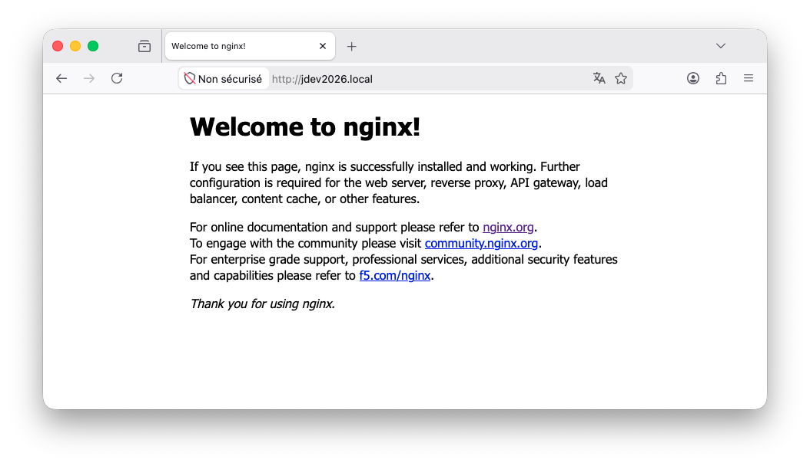
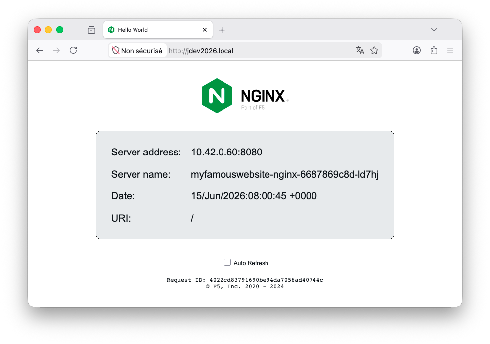

# Exercice 6 : déployer une application avec Helm

Depuis le début de cet atelier, nous avons manipulé de nombreux fichiers de configuration Kubernetes pour différents types de ressources : `Deployments`, `Services` (`ClusterIP`, `NodePort`), `Ingress`, etc. Cette approche offre une grande flexibilité, mais elle peut rapidement devenir répétitive et verbeuse. Dans la plupart des cas, nous souhaiterons simplement déployer une application en personnalisant quelques paramètres essentiels, sans avoir à gérer l'ensemble des manifestes Kubernetes.

L'outil [Helm](https://helm.sh/) répond à ce besoin en proposant un système de templating et de gestion de paquets pour Kubernetes. Les configurations sont regroupées dans un package appelé `Chart` contenant des modèles de ressources Kubernetes et des valeurs paramétrables. Il devient alors possible de déployer, de mettre à jour et de versionner une application en modifiant uniquement les paramètres qui nous intéressent.

Ce sixième et dernier exercice a pour objectif de découvrir [Helm](https://helm.sh/) à travers l'utilisation d'un `Chart` [Nginx](https://www.nginx.com/). Nous nous concentrerons sur le déploiement et la personnalisation d'une application à l'aide d'un `Chart` existant. La création de `Charts` [Helm](https://helm.sh/) ne sera pas abordée dans le cadre de cet exercice.

## But

* Ajouter un dépôt de `Chart` [Helm](https://helm.sh/)
* Installer un `Chart` [Helm](https://helm.sh/) en modifiant les paramètres souhaités
* Mettre à jour un `Chart` [Helm](https://helm.sh/) déployé

## Étapes à suivre

* Avant de commencer les étapes de cet exercice, assurez-vous que le `Namespace` créé dans l'exercice précédent `mynamespaceexercice5` soit supprimé. Si ce n'est pas le cas :

```bash
kubectl delete namespace mynamespaceexercice5
```

* Créer un `Namespace` pour cet exercice sans forcément créer un fichier spécifique.

```bash
kubectl create namespace mynamespaceexercice6
```

Ci-dessous sont données les instructions d'installation de [Helm](https://helm.sh/) pour macOS et Linux.

---

**macOS** : pour installer [Helm](https://helm.sh/) via [Homebrew](https://brew.sh/) :

```bash
brew install helm
```

**Linux** : pour installer [K3d](https://k3d.io/) :

```bash
curl -fsSL -o get_helm.sh https://raw.githubusercontent.com/helm/helm/main/scripts/get-helm-4
chmod 700 get_helm.sh
./get_helm.sh
```

---

* Pour s'assurer que [Helm](https://helm.sh/) est correctement installé, exécuter la commande suivante :

```bash
helm version
```

La sortie console attendue :

```bash
version.BuildInfo{Version:"v4.2.1", ...}
```

Afin d'utiliser des `Charts` [Helm](https://helm.sh/), il faut ajouter un dépôt. Pour cet atelier, nous utiliserons les `Charts` [Helm](https://helm.sh/) proposés par [Bitnami](https://bitnami.com/). Ce dépôt regroupe les principales applications open source et notamment [Nginx](https://www.nginx.com/) que nous allons utiliser.

* Ajouter le dépôt [Helm](https://helm.sh/) de [Bitnami](https://bitnami.com/)

```bash
helm repo add bitnami https://charts.bitnami.com/bitnami 
```

La sortie console attendue :

```bash
"bitnami" has been added to your repositories
```

* Dés lors que vous avez ajouté un dépôt, vous pouvez lister les dépôts déclarés sur votre poste.

```bash
helm repo list
```

La sortie console attendue :

```bash
NAME                  	URL
bitnami               	https://charts.bitnami.com/bitnami
```

Par ailleurs, il est possible d’ajouter un grand nombre d’autres dépôts, notamment depuis un serveur que j’administre :

```bash
NAME                  	URL
ingress-nginx         	https://kubernetes.github.io/ingress-nginx
nvidia                	https://helm.ngc.nvidia.com/nvidia
onyxia                	https://inseefrlab.github.io/onyxia
kyverno               	https://kyverno.github.io/kyverno/
hashicorp             	https://helm.releases.hashicorp.com
prometheus-community  	https://prometheus-community.github.io/helm-charts
inseefrlab-datascience	https://inseefrlab.github.io/helm-charts-interactive-services
ollama-helm           	https://otwld.github.io/ollama-helm/
bitnami               	https://charts.bitnami.com/bitnami
```

* Un dépôt contient un ensemble de `Charts` [Helm](https://helm.sh/). Pour afficher tous les dépôts (145), utilisez cette commande :

```bash
helm search repo bitnami
```

La sortie console attendue :

```bash
NAME                                        	CHART VERSION	APP VERSION  	DESCRIPTION
bitnami/airflow                             	25.0.2       	3.0.5        	Apache Airflow is a tool to express and execute...
bitnami/apache                              	11.4.29      	2.4.65       	Apache HTTP Server is an open-source HTTP serve...
bitnami/apisix                              	6.0.0        	3.13.0       	Apache APISIX is high-performance, real-time AP...
bitnami/appsmith                            	7.0.3        	1.85.0       	Appsmith is an open source platform for buildin...
bitnami/argo-cd                             	11.0.0       	3.1.1        	Argo CD is a continuous delivery tool for Kuber...
bitnami/argo-workflows                      	13.0.6       	3.7.1        	Argo Workflows is meant to orchestrate Kubernet...
bitnami/aspnet-core                         	9.4.2        	10.0.9       	ASP.NET Core is an open-source framework for we...
...
bitnami/nginx                               	25.0.5       	1.31.1       	NGINX Open Source is a web server that can be a...
...
```

> Si vous omettez le nom du dépôt, tous les `Charts` [Helm](https://helm.sh/) de tous les dépôts seront affichés.

La version du `Chart` [Nginx](https://www.nginx.com/) est la 25.0.5, laquelle correspond à la version 1.31.1 de [Nginx](https://www.nginx.com/).

Il est possible d'afficher les différentes versions d'un `Chart` donné comme par exemple avec cette commande :

```bash
helm search repo bitnami/nginx --versions
```

La sortie console attendue :

```bash
NAME                            	CHART VERSION	APP VERSION	DESCRIPTION
bitnami/nginx                   	25.0.5       	1.31.1     	NGINX Open Source is a web server that can be a...
bitnami/nginx                   	25.0.3       	1.31.1     	NGINX Open Source is a web server that can be a...
bitnami/nginx                   	25.0.2       	1.31.1     	NGINX Open Source is a web server that can be a...
bitnami/nginx                   	25.0.0       	1.31.1     	NGINX Open Source is a web server that can be a...
bitnami/nginx                   	24.0.4       	1.31.1     	NGINX Open Source is a web server that can be a...
bitnami/nginx                   	24.0.3       	1.31.1     	NGINX Open Source is a web server that can be a...
bitnami/nginx                   	24.0.2       	1.31.1     	NGINX Open Source is a web server that can be a...
bitnami/nginx                   	24.0.1       	1.31.0     	NGINX Open Source is a web server that can be a...
```

Dans ce cas, la version du `Chart` [Helm](https://helm.sh/) peut évoluer pour une même version de l'application. La version de l'application est cela qui a été **testée et validée** au moment de la sortie du `Chart` [Helm](https://helm.sh/). Cependant, [Bitnami](https://bitnami.com/) applique une politique de sécurité très stricte, ils reconstruisent leurs images Docker tous les jours pour y intégrer les derniers correctifs de sécurité Linux (CVE) et les patchs de l'application. Or, si l'équipe de [Nginx](https://www.nginx.com/) publie une version corrective mineure (comme la 1.31.1) et que [Bitnami](https://bitnami.com/) estime qu'elle doit remplacer la 1.31.0 pour des raisons de sécurité dans cette branche, leur image contiendra en réalité les binaires de la 1.31.1, mais sera taguée 1.31 ([Bitnami Rolling Tags](https://techdocs.broadcom.com/us/en/vmware-tanzu/bitnami-secure-images/bitnami-secure-images/services/bsi-doc/apps-tutorials-understand-rolling-tags-containers-index.html)).

> Les versions des `Charts` ne sont pas mises à jour explicitement, vous avez besoin d'utiliser cette commande pour mettre à jour tous les dépôts : `helm repo update`.

Les `Charts` [Helm](https://helm.sh/) contiennent des modèles de ressources Kubernetes ainsi que des valeurs paramétrables. Ces valeurs permettent de configurer différents aspects du déploiement, tels que le nombre de réplicas, l’`Ingress`, les ressources CPU et mémoire, les variables applicatives ou encore le stockage. L’obtention des valeurs par défaut peut se faire soit directement dans le code source du `Chart` [Helm](https://helm.sh/), soit via une commande dédiée.

* Exécuter la commande dédiée pour obtenir les valeurs modifiables du `Chart` [Helm](https://helm.sh/) [Nginx](https://www.nginx.com/).

```bash
helm show values bitnami/nginx > values-default.yaml
```

Consultez le fichier obtenu et notez que l'`Ingress` n'est pas activé par défaut (`ingress: enabled: false`). 

* Déployer [Nginx](https://www.nginx.com/) en se basant sur le `Chart` [Helm](https://helm.sh/) en version 24.0.1 qui correspond à la version 1.31.0 de [Nginx](https://www.nginx.com/) qui a été **testée et validée**. `myfamouswebsite` sera le nom de la configuration utilisée. Nous pourrons mettre à jour cette configuration en rappelant ce même nom.

```bash
helm install myfamouswebsite bitnami/nginx -n mynamespaceexercice6 --version 24.0.1
```

La sortie console attendue :

```bash
NAME: myfamouswebsite
LAST DEPLOYED: Fri Jun 12 18:58:31 2026
NAMESPACE: mynamespaceexercice6
STATUS: deployed
REVISION: 1
DESCRIPTION: Install complete
TEST SUITE: None
NOTES:
CHART NAME: nginx
CHART VERSION: 24.0.1
APP VERSION: 1.31.0

⚠ WARNING: Since August 28th, 2025, only a limited subset of images/charts are available for free.
    Subscribe to Bitnami Secure Images to receive continued support and security updates.
    More info at https://bitnami.com and https://github.com/bitnami/containers/issues/83267

** Please be patient while the chart is being deployed **
NGINX can be accessed through the following DNS name from within your cluster:

    myfamouswebsite-nginx.mynamespaceexercice6.svc.cluster.local (port 80)

To access NGINX from outside the cluster, follow the steps below:

1. Get the NGINX URL by running these commands:

  NOTE: It may take a few minutes for the LoadBalancer IP to be available.
        Watch the status with: 'kubectl get svc --namespace mynamespaceexercice6 -w myfamouswebsite-nginx'

    export SERVICE_PORT=$(kubectl get --namespace mynamespaceexercice6 -o jsonpath="{.spec.ports[0].port}" services myfamouswebsite-nginx)
    export SERVICE_IP=$(kubectl get svc --namespace mynamespaceexercice6 myfamouswebsite-nginx -o jsonpath='{.status.loadBalancer.ingress[0].ip}')
    echo "http://${SERVICE_IP}:${SERVICE_PORT}"
WARNING: Rolling tag detected (bitnami/nginx:latest), please note that it is strongly recommended to avoid using rolling tags in a production environment.
+info https://techdocs.broadcom.com/us/en/vmware-tanzu/bitnami-secure-images/bitnami-secure-images/services/bsi-doc/apps-tutorials-understand-rolling-tags-containers-index.html
WARNING: Rolling tag detected (bitnami/git:latest), please note that it is strongly recommended to avoid using rolling tags in a production environment.
+info https://techdocs.broadcom.com/us/en/vmware-tanzu/bitnami-secure-images/bitnami-secure-images/services/bsi-doc/apps-tutorials-understand-rolling-tags-containers-index.html
WARNING: Rolling tag detected (bitnami/nginx-exporter:latest), please note that it is strongly recommended to avoid using rolling tags in a production environment.
+info https://techdocs.broadcom.com/us/en/vmware-tanzu/bitnami-secure-images/bitnami-secure-images/services/bsi-doc/apps-tutorials-understand-rolling-tags-containers-index.html

WARNING: There are "resources" sections in the chart not set. Using "resourcesPreset" is not recommended for production. For production installations, please set the following values according to your workload needs:
  - cloneStaticSiteFromGit.gitSync.resources
  - resources
+info https://kubernetes.io/docs/concepts/configuration/manage-resources-containers/
```

Les informations affichées après la création indiquent généralement comment configurer votre poste client afin d'accéder au `Pod` nouvellement créé. Nous verrons plus loin la méthode la plus simple pour se connecter à ce `Pod`. Vous remarquerez également que la version de l'image de l'application [Nginx](https://www.nginx.com/) déployée est la 1.31.0 (`APP VERSION: 1.31.0`).

* Vérifier que le `Chart` [Helm](https://helm.sh/) a été correctement déployé

```bash
helm list -n mynamespaceexercice6
```

La sortie console attendue :

```bash
NAME           	NAMESPACE           	REVISION	UPDATED                              	STATUS  	CHART       	APP VERSION
myfamouswebsite	mynamespaceexercice6	1       	2026-06-15 08:53:01.341826 +0200 CEST	deployed	nginx-24.0.1	1.31.0
```

* Vérifier que le `Pod` a été créé via la commande suivante :

```bash
kubectl get pods -n mynamespaceexercice6
```

La sortie console attendue :

```bash
NAME                                   READY   STATUS    RESTARTS   AGE
myfamouswebsite-nginx-9f686866-w6jjc   1/1     Running   0          35m
```

* Vérifions que version de depuis le Pod.

```bash
kubectl exec myfamouswebsite-nginx-9f686866-w6jjc -n mynamespaceexercice6 -- nginx -v
```

La sortie console attendue :

```bash
nginx version: nginx/1.31.1
```

Cela rejoint la remarque précédente puisque la version indiquée (1.31.0) est la version testée et validée au moment de la publication du `Chart` [Helm](https://helm.sh/), mais les images [Bitnami](https://bitnami.com/) peuvent contenir des correctifs de sécurité plus récents tout en conservant le même tag de version.

À cette étape, nous aimerions pouvoir visualiser la page et le plus simple comme vu dans un précédent exercice est d'utiliser un `Ingress`. De même, pour simuler une charge importante, nous allons configurer le replicaset afin d'avoir trois `Pods`.

* Créer dans le répertoire _exercice6-helm/_ un fichier appelé _values.yaml_ en ajoutant le contenu suivant :

```yaml
replicaCount: 3
ingress:
  enabled: true
  hostname: mydomain.test
```

Les champs des paramètres utilisés sont conformes aux paramètres présents dans le fichier _values-default.yaml_. 

* Appliquer cette nouvelle configuration en utilisant le même nom que lors de la création `myfamouswebsite`. Cette fois, nous ne précisons pas la version du `Chart` [Helm](https://helm.sh/) qui par défaut prendra la plus haute version connue.

```bash
helm upgrade myfamouswebsite bitnami/nginx -n mynamespaceexercice6 -f values.yaml
```

La sortie console attendue :

```bash
Release "myfamouswebsite" has been upgraded. Happy Helming!
NAME: myfamouswebsite
LAST DEPLOYED: Mon Jun 15 09:39:51 2026
NAMESPACE: mynamespaceexercice6
STATUS: deployed
REVISION: 2
DESCRIPTION: Upgrade complete
TEST SUITE: None
NOTES:
CHART NAME: nginx
CHART VERSION: 25.0.5
APP VERSION: 1.31.1
...
```

* Vérifier que trois `Pods` ont été créés.

```bash
kubectl get pods -n mynamespaceexercice6
```

La sortie console attendue :

```bash
NAME                                     READY   STATUS    RESTARTS   AGE
myfamouswebsite-nginx-647bdf7bd8-bs6l5   1/1     Running   0          3m50s
myfamouswebsite-nginx-647bdf7bd8-k6pgd   1/1     Running   0          3m35s
myfamouswebsite-nginx-647bdf7bd8-r2sk8   1/1     Running   0          3m43s
```

Il ne reste plus qu’à tester l’application déployée. En l’absence de nom de domaine, nous allons utiliser le fichier _/etc/hosts_ pour la rendre accessible localement.

* Editer votre fichier _/etc/hosts_ et ajouter la ligne suivante.

```bash
...
127.0.0.1       mydomain.test
```

* Ouvrir un navigateur et saisir l'URL suivante : <http://mydomain.test/>. Veuillez vous assurer qu'une page web s'affiche correctement comme montré sur la figure suivante.



À ce stade, nous souhaitons pouvoir personnaliser la page web déployée. Pour cela, nous allons utiliser le champ `initContainers` afin d’initialiser le contenu de la page web. Nous en profiterons pour déployer une page hébergée sur GitHub, capable d’afficher les informations du `Pod` ayant traité la requête, ce qui est utile dans un contexte où trois `Pods` sont en service. Enfin, nous utiliserons le champ `serverBlock` pour définir la configuration du serveur de l’application déployée. Ce dépôt <https://github.com/nginxinc/NGINX-Demos.git> fournit des exemples pour [Nginx](https://www.nginx.com/).

* Éditer de nouveaule fichier _values.yaml_ en ajoutant les informations suivantes.

```yaml
replicaCount: 3
ingress:
  enabled: true
  hostname: mydomain.test

extraVolumes:
  - name: web-content
    emptyDir: {}

extraVolumeMounts:
  - name: web-content
    mountPath: /app

initContainers:
  - name: git-clone
    image: alpine/git
    command:
      - sh
      - -c
      - |
        git clone https://github.com/nginxinc/NGINX-Demos.git /tmp/repo
        cp /tmp/repo/nginx-hello/index.html /app/index.html
    volumeMounts:
      - name: web-content
        mountPath: /app

serverBlock: |
  server {
      listen 8080;

      root /app;
      index index.html;

      location / {
          try_files /index.html =404;

          sub_filter_once off;
          sub_filter 'server_hostname' '$hostname';
          sub_filter 'server_address' '$server_addr:$server_port';
          sub_filter 'server_url' '$request_uri';
          sub_filter 'server_date' '$time_local';
          sub_filter 'request_id' '$request_id';
      }
  }
```

* Refraichir la page du navigateur <http://mydomain.test/>. Veuillez vous assurer qu'à chaque mise à jour, le `Pod` utilisé est différent (champ `Server name:`).



Comme vous avez pu la constater [Helm](https://helm.sh/) permet de s'abstraire de manipuler tous les fichiers de configuration que nous avons pu explorer dans les précédents exercices. Si vous souhaitez les obtenir à partir de la configuration `myfamouswebsite` exécuter la commande suivante.

```bash
helm get manifest myfamouswebsite -n mynamespaceexercice6
```

La sortie console attendue :

```bash
---
# Source: nginx/templates/networkpolicy.yaml
kind: NetworkPolicy
apiVersion: networking.k8s.io/v1
metadata:
  name: myfamouswebsite-nginx
  namespace: "mynamespaceexercice6"
  labels:
    app.kubernetes.io/instance: myfamouswebsite
    app.kubernetes.io/managed-by: Helm
    app.kubernetes.io/name: nginx
    app.kubernetes.io/version: 1.31.1
    helm.sh/chart: nginx-25.0.5
...
```

## Bilan de l'exercice

À cette étape, vous savez :

* ajouter un dépôt de `Chart` [Helm](https://helm.sh/) basé sur [Bitnami](https://bitnami.com/) ;
* installer le `Chart` [Helm](https://helm.sh/) [Nginx](https://www.nginx.com/) en modifiant des paramètres ;
* mettre à jour une configuration [Helm](https://helm.sh/) déjà déployée.

## Avez-vous bien compris ?

Pour continuer sur la manipulation de [Helm](https://helm.sh/), nous vous proposons d'installer l'application [Wordpress](https://wordpress.com) en configurant les éléments suivants :

* activer l'`Ingress` ;
* modifier les nom d'utilisateur et les mot de passe de [Wordpress](https://wordpress.com) et de la base de données.

## Ressources

* https://techdocs.broadcom.com/us/en/vmware-tanzu/bitnami-secure-images/bitnami-secure-images/services/bsi-doc/apps-tutorials-best-practices-hardening-containers-index.html