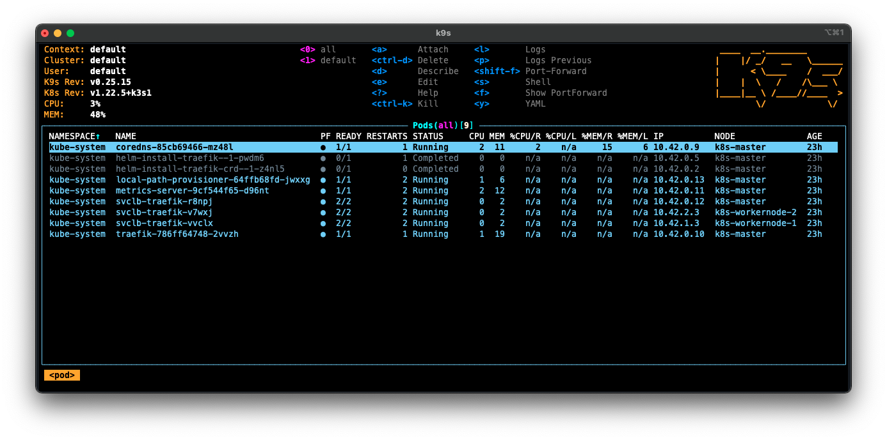

# Exercice 1 : créer un premier POD et manipuler son environnement d'orchestration K8s

Ce premier exercice s'intéresse à la création de l'entité de référence dans un cluster Kubernetes à savoir un Pod qui est une représentation logique de un ou plusieurs conteneurs. Nous allons donc voir comment manipuler un Pod pour le créer, s'y connecter via son conteneur associé et pour le supprimer. Nous étudierons également comment écrire un fichier de configuration utilisé pour faciliter l'exportation des paramètres d'un Pod. Nous verrons également l'intérêt d'utiliser un `namespace` pour isoler les différents objets créés dans un cluster Kubernetes. Enfin, nous montrerons via une première solution comment accéder par le réseau à un Pod.

Ce premier exercice sera aussi l'occasion de manipuler les outils **kubectl** et [K9s](https://k9scli.io/) que nous avons installés lors de la mise en place de notre cluster Kubernetes.

> Quelque soit le type d'installation choisi pour la mise en place de votre cluster Kubernetes, toutes les commandes ci-dessous devraient normalement fonctionner. Nous considérons qu'il existe un fichier `k3s.yaml` à la racine du dossier `microservices-kubernetes-gettingstarted-tutorial/`, si ce n'est pas le cas, merci de reprendre la mise en place d'un cluster Kubernetes. Il est important ensuite de s'assurer que la variable `KUBECONFIG` soit initialisée avec le chemin du fichier d'accès au cluster Kubernetes (`export KUBECONFIG=$PWD/k3s.yaml`).

## But

* Manipuler un Pod (créer, se connecter via son conteneur associé, supprimer)
* Écrire un fichier de configuration pour décrire un objet Pod
* Accéder à un Pod

## Étapes à suivre

* Créer deux invites de commande, l'une pour l'exécution de [K9s](https://k9scli.io/) et la seconde pour la saisie des commandes avec l'outil **kubectl**, puis se placer pour chaque invite de commande à la racine du dossier `microservices-kubernetes-gettingstarted-tutorial/`. Pour faciliter l'identification des invites de commande, nous les appellerons respectivement *k9s* et *kubectl*.

* Depuis l'invite de commande *k9s* : 

```
$ export KUBECONFIG=$PWD/k3s.yaml
$ k9s
```



L'outil [K9s](https://k9scli.io/) affiche tous les objets créés au sein du cluster. L'affichage au démarrage donne l'ensemble des objets de type Pod. Les Pods déjà présents concernent le fonctionnement interne de Kubernetes. Ces Pods sont identifiables par le namespace appelé `kube-system` (colonne `NAMESPACE`).

L'utilisation [K9s](https://k9scli.io/) est très proche à l'éditeur de texte **Vim**. Deux modes sont disponibles : *commande* et *recherche*. Pour saisir une commande, la touche `:` doit être utilisée. Ce mode est identifiable par la forme du prompt `🐶>` qui représente un Bigle (enfin je crois). L'ensemble des commandes est disponible via le raccourci `ctrl + a` ou via la commande `:aliases`. Pour effectuer une recherche, la touche `/` doit être utilisée. Ce mode est identifiable par la forme du prompt `🐩>` qui est un Caniche (il n'y a pas à se tromper là).

* Depuis l'outil [K9s](https://k9scli.io/), afficher la liste des namespaces via la commande `:namespace`.


Un ensemble de namespace est donné par l'outil [K9s](https://k9scli.io/). Ces namespaces existent déjà car ils sont utilisés pour le fonctionnement interne de Kubernetes.

* Depuis l'outil [K9s](https://k9scli.io/), afficher la liste des Pods via la commande `:pods`.

Nous allons obtenir les mêmes informations depuis l'outil **kubectl**. Cependant contrairement à l'outil [K9s](https://k9scli.io/), elles ne pourront être mises à jour qu'en exécutant plusieurs fois la même ligne de commande. En effet, [K9s](https://k9scli.io/) est réactif et tout changement sur le cluster Kubernetes est automatiquement affiché à l'utilisateur (sous condition qu'il se trouve dans la bonne commande).

* Depuis l'invite de commande *kubectl* :

```
$ export KUBECONFIG=$PWD/k3s.yaml
$ kubectl get pods --all-namespaces
NAMESPACE     NAME                                     READY   STATUS      RESTARTS       AGE
kube-system   helm-install-traefik-crd--1-z4nl5        0/1     Completed   0              6d15h
kube-system   helm-install-traefik--1-pwdm6            0/1     Completed   1              6d15h
kube-system   svclb-traefik-vvclx                      2/2     Running     6 (122m ago)   6d15h
kube-system   svclb-traefik-v7wxj                      2/2     Running     6 (122m ago)   6d15h
kube-system   local-path-provisioner-64ffb68fd-jwxxg   1/1     Running     6 (122m ago)   6d15h
kube-system   coredns-85cb69466-mz48l                  1/1     Running     3 (122m ago)   6d15h
kube-system   svclb-traefik-r8npj                      2/2     Running     6 (122m ago)   6d15h
kube-system   traefik-786ff64748-2vvzh                 1/1     Running     3 (122m ago)   6d15h
kube-system   metrics-server-9cf544f65-d96nt           1/1     Running     6 (122m ago)   6d15h
```

L'option `get` permet de récupérer les informations de l'objet passé en paramètre `pods`. Le paramètre `--all-namespaces` indique que tous les namespaces sont considérés.

* Affichons maintenant la liste des namespaces de notre cluster Kubernest, depuis l'invite de commande *kubectl* :

```
$ kubectl get namespace
NAME              STATUS   AGE
default           Active   6d15h
kube-system       Active   6d15h
kube-public       Active   6d15h
kube-node-lease   Active   6d15h
```

Il est maintenant temps de créer notre premier Pod qui pour rappel est une représentation logique de un ou plusieurs conteneurs. 

* Dans l'exemple qui va suivre, nous allons créer un Pod avec un conteneur basé sur l'image du serveur web Nginx. Depuis l'invite de commande *kubectl* :

```
$ kubectl run myfirstpod --image=nginx:latest
pod/myfirstpod created
```

* Pour s'assurer que le Pod a été créé :

```
$ kubectl get pods
NAME         READY   STATUS    RESTARTS   AGE
myfirstpod   1/1     Running   0          43s
```

Depuis l'outil [K9s](https://k9scli.io/), vous devriez obtenir le résultat suivant (commande `:pods`).


* kubectl exec puor modifier le fichier image
* suppression du pod
* Créer un Pod en écrivant un fichier de configuration
* suppression du pod
* Créer un Pod dans un namespace
* suppression du namespace
* Créer un Pod avec deux conteneurs dans un namespace et expliquer comment il communique
* proxy pour accéder au Pod

### Bilan de l'exercice

* 

### Avez-vous bien compris ?

* Créer un Pod basé sur une image Apache HTTP et modifier le contenu du répertoire

### Ressources

* https://blog.eleven-labs.com/fr/k9s/
* https://medium.com/flant-com/k9s-terminal-ui-for-kubernetes-aeead8b0303f
